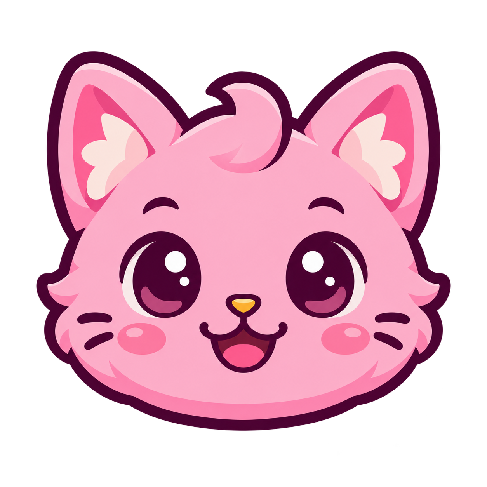
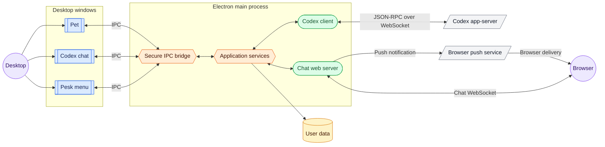
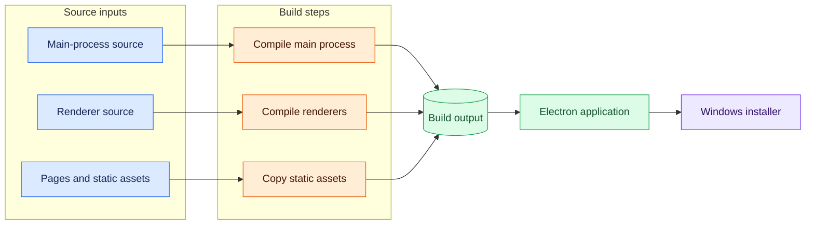

<p align="center">
  
</p>

# Pesk

Pesk is a lightweight Windows desktop pet built with Electron and TypeScript. It combines an animated, always-on-top companion with a dedicated Codex chat window, keyboard-driven controls, configurable presets, and a system-tray menu.

## Features

- Animated desktop companion with customizable visual themes
- Integrated Codex workspace for interactive development assistance
- Extensible configuration and external content support after installation
- Productivity automation through configurable Windows application presets
- Native Windows integration through the system tray, keyboard shortcuts, and login startup

## Architecture

Pesk is a Windows Electron desktop pet with a terminal-first Codex companion. The pet remains a lightweight, always-on-top visual and notification surface; the chat window and optional browser client provide focused ways to observe or submit Codex work.

### Runtime topology



`src/main.ts` is the Electron entrypoint. `PeskApplication` in `src/app/application.ts` loads configuration and settings, creates the controllers, registers IPC handlers and global shortcuts, starts the Codex controller and optional web server, and performs shutdown cleanup. Business ownership stays in the focused controller modules rather than in renderer code or the entrypoint.

### Component ownership

| Diagram component    | Ownership and responsibility                                                                                                  |
| -------------------- | ----------------------------------------------------------------------------------------------------------------------------- |
| Desktop windows      | Electron-owned pet, Codex chat, and Pesk menu surfaces for desktop interaction.                                               |
| Secure IPC bridge    | The preload boundary that safely carries window requests and main-process state updates.                                      |
| Application services | Main-process coordination for configuration, settings, animations, presets, window lifecycle, and cross-component behavior.   |
| Codex client         | Main-process connection and state owner for JSON-RPC requests, threads, turns, streaming, approvals, and user-input requests. |
| Chat web server      | Main-process LAN server for pairing, authenticated browser chat, state broadcasts, and push notification requests.            |
| User data            | Local persisted configuration, settings, device credentials, VAPID keys, subscriptions, and external content.                 |
| Codex app-server     | External service that receives and streams Codex JSON-RPC traffic.                                                            |
| Browser push service | External browser-vendor delivery service used for Web Push notifications.                                                     |

### Interaction flow

Desktop windows communicate with the Electron main process through the secure preload IPC bridge. The main process publishes shared pet and Codex state back to the desktop surfaces and, when enabled, the browser client.

The Codex client uses JSON-RPC over WebSocket with the app-server. It initializes the connection before other requests, handles streamed thread and turn events, and answers server-initiated approvals and user-input requests with their original request IDs. The terminal remains the primary Codex interaction; Pesk mirrors relevant activity and provides a focused companion chat.

The Electron main-process services own configuration, persisted data, browser pairing, browser WebSocket access, and Web Push. These remain within the Electron main-process boundary and use the user-data directory for local state.

### Build and packaging



`npm run build` compiles the main/preload and renderer TypeScript, then copies renderer HTML, CSS, web assets, and required vendor files into `build/renderer`. Electron executes `build/main.js`, so source changes affecting runtime behavior require a rebuild. Electron Builder packages `build/**/*`, `assets/**/*`, and `package.json`; installer artifacts belong in `dist/`. User configuration and mutable animations are intentionally external to the packaged executable.

## Requirements

- Windows for the packaged application and monitor-placement presets
- Node.js and npm for development and packaging

## Development

```bash
npm install
npm start
```

Useful commands:

```bash
npm run build     # Compile main and renderer TypeScript
npm test          # Build and run Jest tests
npm run dist      # Build the Windows NSIS installer
```

Compiled runtime files are written to `build/`. The installer is written to `dist/Pesk-Setup-<version>.exe`.

To open detached DevTools for the pet, chat, and menu windows:

```bash
DESKTOP_PET_DEVTOOLS=1 npm start
```

## Configuration

Pesk uses JSON configuration for application behavior and keeps user preferences in a separate settings file.

- During development, the repository root `config.json` provides the default configuration.
- Installed builds use `%APPDATA%\pesk\config.json` as the user override. The file is created or edited manually; it is intentionally not included in the installer.
- User preferences such as the selected animation, visibility, pause state, and lock state are stored in `%APPDATA%\pesk\settings.json`.

When both configuration files exist, values in the user configuration override the bundled or development defaults. Restart Pesk after changing configuration.

### Application configuration

Example application configuration:

```json
{
  "fps": 24,
  "petSize": 180,
  "chatWidth": 600,
  "chatHeight": 700,
  "animationsDir": "animations",
  "codexAppServerUrl": "ws://127.0.0.1:4500",
  "codexStatusSound": "audio.mp3",
  "webAccessEnabled": false,
  "webPort": 4587,
  "webTlsKey": "",
  "webTlsCert": ""
}
```

Configuration fields:

- `fps` and `petSize` control default animation playback and rendering.
- `chatWidth` and `chatHeight` control the desktop chat window dimensions.
- `animationsDir` selects the external animation directory. Relative paths are resolved beside the active configuration file.
- `codexAppServerUrl` specifies the Codex app-server WebSocket endpoint.
- `codexStatusSound` specifies an optional sound file. Relative paths are resolved beside the active configuration file.
- `webAccessEnabled` enables the browser-based chat endpoint. It is disabled by default.
- `webPort` specifies the HTTP/WebSocket listening port. The default is `4587`.
- `webTlsKey` and `webTlsCert` optionally enable HTTPS/WSS for the web chat. Relative paths resolve beside the active configuration file; configure both together.
- `presets` defines named Windows commands or URLs available from the Pesk menu. Each action may specify a `command`, `args`, and an optional one-based `monitor`.
- `animations` provides per-animation overrides such as `fps`. Animation folders contain numbered PNG frames, for example:

```text
<active-config-directory>\animations\dance\001.png
```

### Keyboard shortcuts

All shortcut definitions are centralized in `src/renderer/shared/shortcuts.ts`.
Global shortcuts are fixed application behavior; they are not configuration
options.

| Shortcut                          | Context                | Action                                           |
| --------------------------------- | ---------------------- | ------------------------------------------------ |
| `Ctrl+Down`                       | Global                 | Open the Pesk menu                               |
| `Ctrl+Up`                         | Global                 | Focus the pet, chat input, or pending question   |
| `Ctrl+Left` / `Ctrl+Right`        | Chat                   | Switch to the previous or next Codex session     |
| `Ctrl+Up`                         | Chat                   | Focus the pending question option                |
| `Ctrl+C` / `Cmd+C`                | Chat history           | Copy the selected message                        |
| `Alt+Home` / `Alt+End`            | Chat history           | Scroll to the top or bottom                      |
| `Alt+Up` / `Alt+Down`             | Chat history           | Select the previous or next message              |
| `Alt+Shift+Up` / `Alt+Shift+Down` | Chat history           | Select the previous or next user message         |
| `Shift+Up` / `Shift+Down`         | Chat history           | Scroll history by one step                       |
| `Alt+Right`                       | Chat history           | Copy the selected message into the composer      |
| `Shift+Enter`                     | Selected chat message  | Expand or collapse the selected message          |
| `Enter`                           | Desktop composer       | Submit the prompt                                |
| `Enter`                           | Web composer           | Insert a newline                                 |
| `Ctrl+Enter`                      | Composer               | Insert a newline                                 |
| `Alt+Enter`                       | Composer               | Steer the active Codex turn, or submit when idle |
| `Ctrl+C`                          | Working composer       | Interrupt the active Codex turn                  |
| `Escape`                          | Chat                   | Hide chat and unfocus the pet                    |
| `Up` / `Down`                     | Suggestions            | Select the previous or next suggestion           |
| `Enter`                           | Suggestions            | Accept the selected suggestion                   |
| `Escape`                          | Suggestions/review     | Dismiss suggestions or cancel the review form    |
| `Up` / `Down`                     | Question options       | Select the previous or next radio option         |
| `Tab`                             | Question options       | Move from an option to its note field            |
| `Tab`                             | Question note          | Return to the selected option                    |
| `Enter`                           | Question/review fields | Submit the current form                          |
| `Tab` / `Shift+Tab`               | Pesk menu              | Move to the next or previous section             |
| `Up` / `Down`                     | Pesk menu              | Move between actions                             |
| `Left` / `Right`                  | Pesk menu device row   | Move between row actions                         |
| `Escape`                          | Pesk menu              | Close the menu                                   |
| `Enter`                           | Pairing field          | Generate a pairing QR code                       |
| `Enter` / `Space`                 | Web connection status  | Reload and reconnect                             |

In the menu’s Presets section, typing unmodified printable characters filters
presets and `Backspace` removes the last filter character.

### Presets

Presets define named actions available from the Pesk menu. An action runs a Windows command with optional arguments. URL arguments can be used with browser commands, and `monitor` specifies a one-based monitor number.

```json
{
  "presets": [
    {
      "name": "Open documentation",
      "actions": [
        {
          "command": "msedge",
          "args": ["--new-window", "https://example.com/docs"]
        }
      ]
    },
    {
      "name": "Open dashboard on monitor 2",
      "actions": [
        {
          "command": "brave",
          "args": ["--new-window", "http://localhost:3000"],
          "monitor": 2
        }
      ]
    }
  ]
}
```

Packaged builds enable Windows login startup after the installed application is launched once.

### Browser chat access

Expose only the Codex chat to a browser on the same trusted LAN.

#### Enable access

1. Set `webAccessEnabled` to `true`.
2. Restart Pesk.
3. Open the Pesk Menu and choose `Pair a device`.
4. Enter a unique device name and press Enter.
5. Scan the displayed QR code with the other device’s camera.

The QR code is single-use and expires after five minutes. Each paired device receives its own credential; credentials are not stored in `config.json`.

#### HTTPS and network safety

The endpoint uses HTTP/WebSocket by default and has no internet relay. HTTPS/WSS is required for PWA installation and browser notifications on LAN devices. Configure both `webTlsKey` and `webTlsCert` to enable it.

Do not expose the endpoint through router port forwarding. Use a trusted LAN or a VPN for remote access.

#### Browser notifications

After pairing:

1. Install the chat as a PWA from the browser’s install command, if desired.
2. If the browser asks for permission, choose Allow.
3. If the prompt does not appear, click `Enable notifications` in the chat.
4. If notifications are blocked, allow them in the browser’s site settings and refresh the chat.

`Web Push ready` means that the browser subscription was successfully saved. The indicator is hidden when setup is valid. It does not guarantee that the phone’s operating-system notification settings will display the notification.

Pesk stores:

- `%APPDATA%\pesk\web-devices.json` — paired devices and hashed credentials.
- `%APPDATA%\pesk\web-push-vapid.json` — server VAPID keys.
- `%APPDATA%\pesk\web-push-subscriptions.json` — browser subscriptions, one active subscription per paired device.

In the Pairing menu, Web Push setup status is separate from delivery control. `Enable push`/`Disable push` controls whether Pesk sends updates; it does not grant browser permission or remove the subscription. The web chat is network-only and does not cache the application shell for offline use.

Web Push uses the browser vendor’s delivery service (for example, FCM or APNs) as an outbound dependency. Pesk does not need a public inbound endpoint or a separate notification server. The browser must be able to reach its push service, and Pesk must be able to make outbound HTTPS requests.

To generate a self-signed certificate for local/LAN HTTPS, run the helper from a shell and include the computer’s LAN IP:

```bash
./scripts/generate-tls-cert.sh "$APPDATA/pesk/tls" 192.168.1.23
```

Replace `192.168.1.23` with the computer’s actual LAN IP. The script prints the `webTlsKey` and `webTlsCert` entries to add to the active configuration.

## Repository Layout

- `src/` — Electron main process, controllers, preload bridge, and renderer modules
- `src/renderer/` — separate pet, chat, and menu pages
- `assets/` — application icon and tray artwork
- `tests/` — Jest tests
- `scripts/` — build cleanup, renderer asset-copy, and TLS certificate helpers
